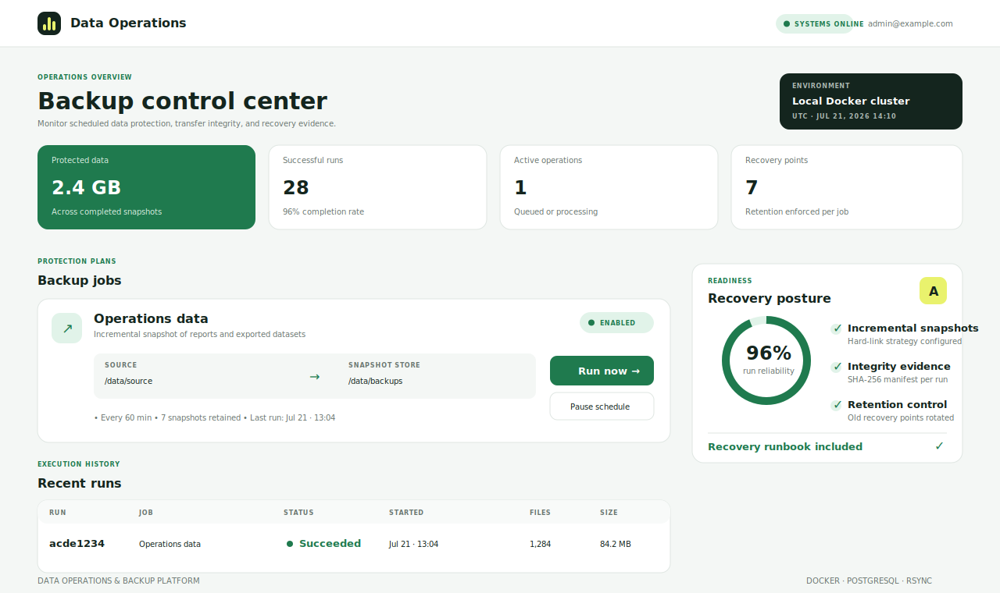
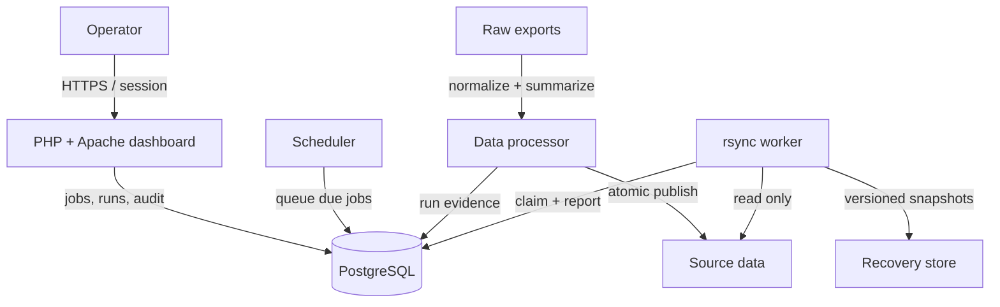

# Data Operations & Backup Platform


A containerized control plane for scheduling, observing, verifying, and restoring incremental filesystem backups. The project separates the authenticated PHP/Apache dashboard from the PostgreSQL state store, scheduler, and least-privilege `rsync` worker.

> Portfolio project by **Bertrand Rusanganwa** · Computer Science, infrastructure, data systems, and secure software engineering.



## Why this project exists

Backup scripts are easy to start and hard to operate reliably. This platform demonstrates the surrounding engineering that makes a backup workflow repeatable: authenticated control, atomic job claiming, immutable audit events, safe path boundaries, versioned recovery points, integrity evidence, retention, and a documented restore drill.

### What it demonstrates

- **Infrastructure:** isolated Docker services for the dashboard, database, processor, scheduler, and backup worker.
- **Data processing:** scheduled CSV normalization and status aggregation with atomic output publication and run evidence.
- **Data operations:** PostgreSQL-backed job state, execution history, indexes, and transactional queueing.
- **Backup engineering:** incremental `rsync` snapshots using hard links, atomic publish, SHA-256 manifests, and retention.
- **Secure application design:** password hashing, CSRF tokens, throttled login attempts, parameterized SQL, secure cookie controls, and HTTP security headers.
- **Operations:** health endpoint, worker logs, cron/systemd examples, recovery runbook, tests, and GitHub Actions CI.

## Architecture



The UI never invokes `rsync` directly. It inserts a queued run in a transaction; the worker atomically claims one run with `FOR UPDATE SKIP LOCKED`. This prevents duplicate processing and keeps the web process away from filesystem privileges.

## Quick start

Requirements: Docker Engine 24+ with Compose v2 and GNU Make (optional).

```bash
git clone https://github.com/bertrandrusa/data-operations-backup-platform.git
cd data-operations-backup-platform
cp .env.example .env
```

Change `POSTGRES_PASSWORD`, `ADMIN_EMAIL`, and `ADMIN_PASSWORD` in `.env`, then start the stack:

```bash
docker compose up --build -d
docker compose ps
```

Open [http://localhost:8080](http://localhost:8080) and sign in with the administrator credentials from `.env`. The processor normalizes the included CSV export and publishes a status summary. The sample backup job protects those outputs once per hour. Click **Run now** to queue an immediate snapshot.

> The first administrator is created only when that email does not exist. Changing `ADMIN_PASSWORD` later does not overwrite an existing password.

## Operate the platform

Queue the sample job from the command line:

```bash
make backup
docker compose logs -f worker
```

List recovery points:

```bash
docker compose exec worker sh -c \
  'find /data/backups/11111111-1111-4111-8111-111111111111 -maxdepth 1 -type d -name "20*" -printf "%f\n" | sort'
```

Verify a snapshot against the SHA-256 manifest saved with its successful run:

```bash
docker compose exec worker /opt/dataops/verify.sh \
  11111111-1111-4111-8111-111111111111 \
  2026-07-21T120000Z-acde1234
```

Run an isolated recovery drill:

```bash
make restore \
  SNAPSHOT=2026-07-21T120000Z-acde1234 \
  RESTORE_TO=/data/restored/quarterly-drill
```

The restore command verifies the manifest first, requires a destination below `/data/restored`, and refuses a non-empty destination. See the complete [operations and recovery runbook](docs/OPERATIONS.md).

## Snapshot strategy

Each successful run creates a directory such as:

```text
/data/backups/<job-id>/
├── 2026-07-21T120000Z-acde1234/
├── 2026-07-21T130000Z-bcde2345/
└── latest -> 2026-07-21T130000Z-bcde2345
```

`rsync --link-dest` hard-links unchanged files to the previous recovery point. Every snapshot still looks complete to an operator, but unchanged content does not consume duplicate blocks. A run is first written to a hidden partial directory and renamed only after transfer and hashing succeed.

## Data model

| Table | Purpose |
|---|---|
| `users` | Operator identities, password hashes, roles, and sign-in metadata |
| `backup_jobs` | Source/target paths, schedule, retention, and next-run state |
| `backup_runs` | Queue state, snapshot identity, sizes, file counts, and manifest hashes |
| `pipeline_runs` | Processing status, record counts, output path, and dataset hash |
| `audit_logs` | Append-only operator and worker activity |
| `login_attempts` | Inputs for short-window authentication throttling |

## Security boundaries

- Source data is mounted read-only into the worker.
- Job paths must remain under configured source and target roots in both PHP and shell validation layers.
- Restore paths must be children of a separate recovery-drill root.
- Audit rows are protected by a database trigger that rejects updates and deletes.
- PostgreSQL is not published to the host network.
- Containers enable `no-new-privileges`; the worker runs as an unprivileged user.
- Secrets belong in `.env` or a production secret manager and are excluded from Git.

This is a production-minded demonstration, not a substitute for an organization-specific disaster-recovery design. Production use should add TLS termination, external secrets, encrypted off-site replication, alerting, SSO/RBAC enforcement, database backups, and tested RPO/RTO targets. See [SECURITY.md](SECURITY.md) and [the architecture notes](docs/ARCHITECTURE.md).

## Repository map

```text
app/                 PHP application, templates, and public assets
database/migrations/ PostgreSQL schema and seed job
docker/              Apache, application, and worker images
worker/              Scheduler, queue, backup, verify, and restore scripts
pipeline/            Scheduled CSV normalization and atomic output publication
docs/                Architecture, operations, cron, and systemd examples
tests/               Dependency-free PHP unit tests
.github/workflows/   Syntax, tests, shell checks, Compose validation, and builds
```

## Development checks

```bash
make test
docker compose config --quiet
docker compose build
```

The CI workflow runs PHP syntax checks and tests, ShellCheck, Compose validation, and container builds on every pull request.

## License

Released under the [MIT License](LICENSE).

Ready to publish? Follow the short [GitHub publishing guide](PUBLISHING.md).
