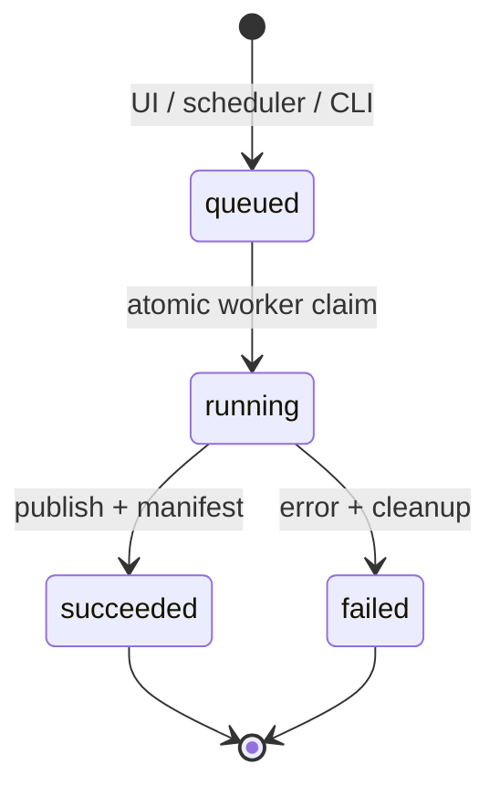

# Architecture notes

## Design goals

The platform is designed around four properties:

1. **Separation of duties.** The web service controls state; a dedicated unprivileged worker owns data movement.
2. **Recoverability.** A backup is useful only when a known snapshot can be verified and restored.
3. **Traceability.** Operator intent and worker results are recorded as append-only events.
4. **Safe failure.** An interrupted transfer never appears as a completed recovery point.

## Service responsibilities

| Service | Responsibility | Filesystem access |
|---|---|---|
| `web` | Authentication, dashboard, job controls, health endpoint | Application image only |
| `database` | Users, configuration, queue state, results, audit evidence | PostgreSQL volume |
| `processor` | Normalizes raw CSV exports, creates summaries, and atomically publishes outputs | Input read-only; processed-data volume read-write |
| `scheduler` | Finds due enabled jobs and queues them transactionally | None |
| `worker` | Claims runs, transfers files, hashes content, rotates retention | Source read-only; backup/restore volumes read-write |

## Run state machine

Only the worker changes a run from `queued` to `running`. The claim statement uses a row lock with `SKIP LOCKED`, so the design can add more workers without allowing two of them to claim the same record.

## Snapshot consistency

The worker writes into `.<snapshot>.partial`. It calculates file count, byte count, and a stable SHA-256 digest over the sorted file manifests. Only then does it rename the directory to its public snapshot name and update the `latest` symlink. An error trap removes the partial directory and marks the run failed.

The processor follows the same publish principle: it builds a normalized export and status summary in a staging directory, records their digest, and then replaces the `current` output directory. The backup worker mounts that processed-data volume read-only.

This guarantees atomic visibility on one filesystem, but it does not make a live source application-consistent. Databases and other mutable applications should produce their own consistent dumps or quiesced export before this filesystem layer protects them.

## Trust boundaries and threats

| Threat | Control in this project | Production extension |
|---|---|---|
| Command/SQL injection | Parameterized SQL; no shell evaluation; strict identifier validation | SAST and dependency scanning |
| Path traversal | Canonical path checks against allowlisted roots | Immutable centrally managed job configuration |
| Stolen password | Modern PHP password hashing; throttling | SSO, MFA, centralized IAM |
| Backup deletion | Append-only audit history; separate recovery volume | Object lock/WORM and off-site replication |
| Tampering | Per-run SHA-256 manifest | Signed manifests and external evidence store |
| Web compromise | Worker isolation; read-only source; no DB host port | Network policies and separate service identities |

## Scaling path

PostgreSQL queue locking supports multiple workers. At higher scale, split workers by storage zone, add heartbeats for abandoned `running` records, store structured transfer telemetry, and use a dedicated queue. Recovery points should replicate to a separate fault domain and expose age/verification alerts tied to service RPOs.
